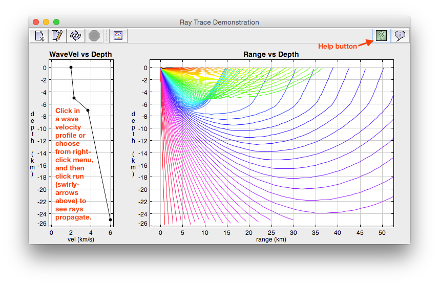

RayDemo, 2005-2015  
Andy Ganse, Applied Physics Laboratory, University of Washington  
aganse@apl.washington.edu  

----------------------------------------------------------------
Dependencies: 
* ptolemy.plot (PTPlot v2.0):
  http://ptolemy.eecs.berkeley.edu/java/ptolemy.plot2.0/ptolemy/plot/

* edu.washington.apl.aganse.ptolemyUpdates:
  https://github.com/aganse/ptolemyUpdates

* edu.washington.apl.aganse.dataTools:
  https://github.com/aganse/dataTools

----------------------------------------------------------------

RayDemo is an interactive, graphical, geophysical raytrace applet,
particularly useful for demonstration/tutorial purposes.  Its
focus is geophysical such as sound/earthquake waves propagting
through the ocean or land, as opposed to light reflections between
objects (a different popular use of raytracing for graphics needs).

You can download and compile the source, or just download and use
the application jarfile, raydemo.jar.  Run it at commandline via:

`> java -jar raydemo.jar`

The class is designed to be run as either an independent application
or as a webapge applet.  Please see my webpage on this app for more
information:
http://staff.washington.edu/aganse/raydemo/intro.html
The page source of that webpage demonstrates calling the code as
an applet, but note a few manual changes still must be toggled in
code to enable as an applet - search for "applet" in source for
relevant lines/comments.  Making that automatic/combined remains
on to-do list.  (Alas this code is terribly commented - also on to-do list.)

See screenshot1.png & screenshot2.png in here, or others on that
webapge above.  Quick running instructions: after starting app per above,
right-click on the WaveVel vs Depth plot (left) and choose e.g.
"Rapid Increase" velocity profile from menu (you can also click in
your own points, either from scratch or adding to the chosen menu
profile).  Then click the swirly-arrows button in toolbar to run
the raytrace and see the raypaths in Range vs Depth plot (right).

Note in addition to calculating/plotting the raypaths themselves,
the app also (with click of toolbar button) opens plots of travel
time vs range and other such information.  This button becomes
activated (non-grayed-out) upon completion of a raytrace run.
Lastly, also note the green Help (labeled "?") button on right
side of toolbar for more information.

